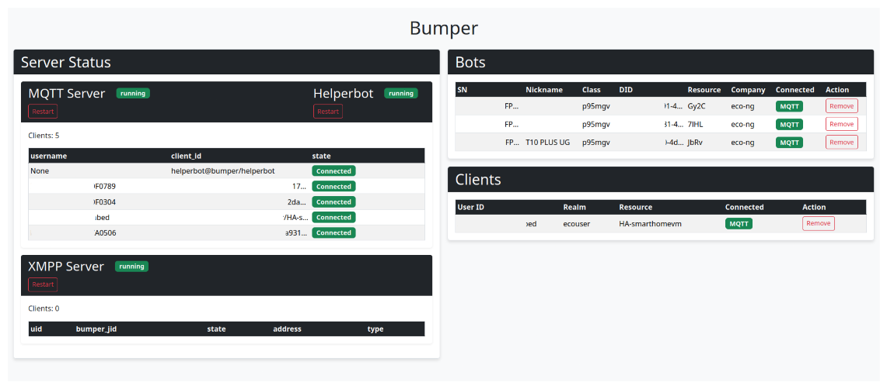

# Bumper


[](https://github.com/MVladislav/bumper/actions/workflows/ci.yml)
[](https://github.com/MVladislav/bumper/actions/workflows/codeql-analysis.yml)
[](https://codecov.io/gh/MVladislav/bumper)
[](https://results.pre-commit.ci/latest/github/MVladislav/bumper/dev)
[](https://github.com/MVladislav/bumper/actions/workflows/docker-release.yml)
[](https://github.com/MVladislav/bumper/actions/workflows/release-drafter.yml)

---

**Forked from [edenhaus](https://github.com/edenhaus/bumper) ➔ [bmartin5692](https://github.com/bmartin5692/bumper)**

---

**Bumper** is a standalone, self-hosted implementation of the central server used by Ecovacs vacuum robots.
This project enables you to take full control of your Ecovacs robots without relying on external servers or cloud services.

By using Bumper, you ensure that your data stays within your home, maintaining both privacy and security while using your Ecovacs cleaning robots.



**Note:** The current master branch is unstable and in active development.


## Key Features

- **Self-Hosted**: Run the server locally at your home without needing to connect to the Ecovacs cloud.
- **Privacy-Focused**: Prevent data transmission to Ecovacs servers by using your own server.
- **Full Control**: Manage your Ecovacs robots locally and access all features without relying on external services.

## Build Status

### Community

A **Gitter community** has been created for Bumper, where users can discuss issues and share insights beyond GitHub.
Join us here:
[](https://gitter.im/ecovacs-bumper/community)

### Testing Needed

Bumper needs your help with **testing** to ensure compatibility and smooth operation as the project evolves.
If you’ve tested Bumper with your Ecovacs bot, please open an issue with feedback on its performance (whether successful or problematic).

> **Important**:  
> _This software is experimental and not yet ready for production use. Please use at your own risk._

## Why?

The motivation behind Bumper can be summed up in a few points:

### 1. Convenience

- Bumper allows your robot to operate without needing an internet connection or relying on Ecovacs servers.

### 2. Performance

- By eliminating the need to send messages to external servers, Bumper improves response times and efficiency.

### 3. Security

- Running the server locally means you can completely isolate your robot from the public Internet, reducing exposure to potential security risks.

## Compatibility

As work to reverse the protocols and provide a self-hosted central server is still in progress, Bumper has had limited testing. There are several EcoVacs models that have not been tested yet.

Bumper should be compatible with most Wi-Fi-enabled robots that use either the **Ecovacs Android/iOS app** or the **Ecovacs Home Android/iOS app**. However, it has only been reported to work on the following models:

| Model           | Protocol Used | Bumper Version Tested | Ecovacs App Tested                                                 |
| :-------------- | :------------ | :-------------------- | :----------------------------------------------------------------- |
| Deebot 900/901  | MQTT          | main                  | Ecovacs/Ecovacs Home                                               |
| Deebot 600      | MQTT          | main                  | Ecovacs Home                                                       |
| Deebot Ozmo 950 | MQTT          | main                  | Ecovacs Home                                                       |
| Deebot T10      | MQTT          | main                  | Ecovacs Home                                                       |
| Deebot X1 Omni  | MQTT          | main                  | [Discussions](https://github.com/MVladislav/bumper/discussions/51) |
| Deebot Ozmo 601 | XMPP          | main                  | Ecovacs                                                            |
| Deebot Ozmo 930 | XMPP          | main                  | Ecovacs/Ecovacs Home                                               |
| Deebot M81 Pro  | XMPP          | v0.1.0                | Ecovacs                                                            |

### Tested with:

| Service                        | Version  | Bot         | Works | Info                                                                                                   |
| :----------------------------- | :------- | :---------- | :---- | :----------------------------------------------------------------------------------------------------- |
| Ecovacs Home                   | 2.2.1    | 930/950/T10 | Y     |                                                                                                        |
| Ecovacs Home                   | 2.4.1    | 930/950/T10 | Y     | Works best                                                                                             |
| Ecovacs Home                   | 2.4.3    | 930/950/T10 | Y     |                                                                                                        |
| Ecovacs Home                   | >= 2.4.4 |             | N     | [Will possibly not work](https://docs.mitmproxy.org/stable/concepts-certificates/#certificate-pinning) |
| Deebot 4 Home Assistant        | 2.1.2    | 950/T10     | Y     |                                                                                                        |
| EcovacsBumper (Home Assistant) | 1.5.3    | 930         | Y     |                                                                                                        |

### Ecovacs Home `>= 2.4.4`

For versions `>= 2.4.4`, the following URLs may not work due to certificate pinning issues:

- `jmq-ngiot-eu.dc.robotww.ecouser.net`
- `a2JaaxoKXLq.iot-as-mqtt.cn-shanghai.aliyuncs.com`

For more information on certificate pinning, refer to the [mitmproxy documentation](https://docs.mitmproxy.org/stable/concepts-certificates/#certificate-pinning).

## Documentation and Getting Started

You can find the full documentation and getting started guide on [Read the Docs](https://bumper.readthedocs.io).

---

## Pre setup

To run this application, a certificate is required.
This certificate will **not** be auto-generated.

You can provide the required certificates in two ways:

1. **Provide your own certificate files** and store them in the following locations:

   - `certs/ca.crt`
   - `certs/bumper.crt`
   - `certs/bumper.key`

2. **Generate the certificates** using the provided script:
   ```sh
   $./scripts/create_cert.sh
   ```

## Basic Configuration for Docker

### Create `.env` file

> In your project directory, create a `.env` file with the following configurations:

```env
# GENERAL variables (mostly by default, change as needed)
# ______________________________________________________________________________
NODE_ROLE=manager
NETWORK_MODE=overlay # by default "bridge"

# GENERAL sources to be used (set by default, change as needed)
# ______________________________________________________________________________
RESOURCES_LIMITS_CPUS=0.25
RESOURCES_LIMITS_MEMORY=250m
RESOURCES_RESERVATIONS_CPUS=0.001
RESOURCES_RESERVATIONS_MEMORY=32m

# APPLICATION version for easy update
# ______________________________________________________________________________
VERSION_BUMPER=develop

# APPLICATION general variable to adjust the apps
# ______________________________________________________________________________
TZ=Europe/Berlin
BUMPER_ANNOUNCE_IP=<Insert your IP>
BUMPER_LISTEN=0.0.0.0

BUMPER_DEBUG_LEVEL=INFO
BUMPER_DEBUG_VERBOSE=1

DEBUG_LOGGING_API_REQUEST=false
DEBUG_LOGGING_API_REQUEST_MISSING=true
DEBUG_LOGGING_XMPP_REQUEST=false
DEBUG_LOGGING_XMPP_REQUEST_REFACTOR=false
DEBUG_LOGGING_XMPP_RESPONSE=false
DEBUG_LOGGING_API_ROUTE=false

# BUILD variable
# ______________________________________________________________________________
PY_VERSION=3.13.1-alpine3.21
UV_VERSION=python3.13-alpine
```

#### Example short `.env` File

```env
NETWORK_MODE=overlay
BUMPER_ANNOUNCE_IP=0.0.0.0 # Replace with the server's public IP
```

### Run docker by

> alias for [docker-swarm](https://github.com/MVladislav/.dotfiles/blob/5ef5f836f1e997fb5a194b28a5b003342fbfa5db/zsh/profile-append#L132)

```sh
# If using Docker Swarm (docker-swarm-compose is an alias)
$docker-swarm-compose deebot

# Default Mode
$docker-compose up -d
```

## Development

### Running the Project Locally

1. Set up a virtual environment:

   ```sh
   $uv venv --python 3.13.0
   $source .venv/bin/activate
   ```

2. Sync the project and install dependencies:

   ```sh
   $uv sync --all-groups --upgrade
   ```

3. Run the project:
   ```sh
   $uv run bumper
   ```

### Check Code Quality & Run Tests

1. Set up the virtual environment and install dependencies:

   ```sh
   $uv venv --python 3.13.0
   $source .venv/bin/activate
   $uv sync --all-groups --upgrade
   ```

2. Run the following checks:
   ```sh
   $clear && pre-commit run --all-files
   $clear && uv run --frozen mypy bumper/
   $clear && uv run --frozen pylint bumper/
   $clear && uv run --frozen pytest tests --cov=./ --cov-report=xml --junitxml=pytest-report.xml
   ```

---

## NOTES

### Clean logs

Clean logs are accessible without credentials by URL:

`https://portal-eu.ecouser.net/api/lg/image/<DID>d@<REPLACED>@<RESOURCE>`

---

## References

- <https://github.com/bmartin5692/bumper>
- <https://github.com/edenhaus/bumper>
- <https://github.com/Yakifo/amqtt>

---

## Thanks

A big thanks to the original project creator @torbjornaxelsson; without his work, this project would have taken much longer to build.

Bumper wouldn’t exist without [Sucks](https://github.com/wpietri/sucks), an open-source client for Ecovacs robots. Thanks to @wpietri and contributors!
