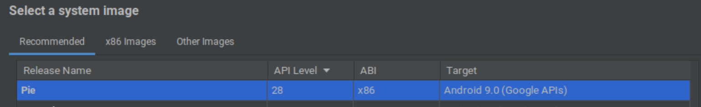

# Ubuntu - Android - Sniffing

- [Ubuntu - Android - Sniffing](#ubuntu---android---sniffing)
  - [Install Env](#install-env)
  - [Install Emulator](#install-emulator)
  - [Setup Emulator](#setup-emulator)
  - [Install App](#install-app)
  - [Run mitmproxy](#run-mitmproxy)
    - [Extend mitmproy](#extend-mitmproy)
  - [Notes](#notes)

## Install Env

Install **[Android Studio](https://snapcraft.io/android-studio)** (for **adb/emulator**)

```sh
$sudo snap install android-studio --classic
```

Follow the setup instructions.

## Install Emulator

Afterwards open **Virtual Device Manager**:


Create a new Device:

- Phone without **Play Store**, example **Pixel 6 Pro**
- As system image choose any version <= **Android 9 (Pie)**
  - used **API Level** <= `28` to allow add system certificate which will used by the app
  - 

## Setup Emulator

root the emulator device and install your certificate:

```sh
# emulator fix (https://www.reddit.com/r/btrfs/comments/l8qu3l/comment/gowtd55/?utm_source=share&utm_medium=web2x&context=3)
$echo "QuickbootFileBacked = off" >> ~/.android/advancedFeatures.ini
# list the before installed emulator
$~/Android/Sdk/emulator/emulator -list-avds
# start the emulator
$~/Android/Sdk/emulator/emulator -cores 4 -memory 4096 -no-boot-anim -writable-system -gpu host -avd <EMULATOR_NAME>

# restart adb as root
$~/Android/Sdk/platform-tools/adb root
# remount /system rw
$~/Android/Sdk/platform-tools/adb remount

# add certificate
$~/Android/Sdk/platform-tools/adb push ca.crt "/system/etc/security/cacerts/$(openssl x509 -inform PEM -subject_hash_old -in ca.crt | head -1).0"
$~/Android/Sdk/platform-tools/adb reboot
$~/Android/Sdk/platform-tools/adb wait-for-device
```

## Install App

Download **[Ecovacs Home App from Aptiode](https://ecovacs-home.en.aptoide.com/app)** or **[Ecovacs Home App from Apkpure](https://apkpure.com/ecovacs-home/com.eco.global.app/download/2.4.1)**
and install in emulator.

For **socks5** proxy, to use with **mitmproxy**, you can
for example install **[Super Proxy from Aptiode](https://super-proxy-scheler-software.en.aptoide.com/app)** or **[Super Proxy from Apkpure](https://apkpure.com/super-proxy/com.scheler.superproxy)**

## Run mitmproxy

> Docker needed for this solution (can be done also without)

Start **mitmproxy** and connect on android emulator over the **Super Proxy** app

With proxy conf:

- PROTOCOL: SOCKS5
- IP: your server ip address where mitmproxy is running
- PORT: 1080

Add your own cert into the subfolder `mitm` as filename `ca.pem` with structure defined here: [**using-a-custom-certificate-authority**](https://docs.mitmproxy.org/stable/concepts-certificates/#using-a-custom-certificate-authority)
or change the command below as you need:

```sh
$clear && docker run --rm -it --network host -v $PWD/mitm:/tmp/mitm mitmproxy/mitmproxy mitmweb -vv --web-host 0.0.0.0 --certs *=/tmp/mitm/ca.pem --mode socks5 --showhost --rawtcp --ssl-insecure  --set connection_strategy=lazy
```

### Extend mitmproy

For easy track communication you can extend with python script inside `mitm` as file `mitm.py`:

````py
import hashlib
import json
from typing import Any

from mitmproxy import ctx, http


class CmdName:
    request: Any | None = None
    response: Any | None = None

    def __init__(
        self, id: str, request: Any | None = None, response: Any | None = None
    ) -> None:
        self.id = id
        self.request = request
        self.response = response


unique_traffic: dict[str, list[CmdName]] = {}


# add cmd_name which you always seen and not want to show in result again
ignore_list = []


def _create_id(flow: http.HTTPFlow) -> tuple[str, str] | None:
    try:
        request_data = json.loads(flow.request.text)
        if cmd_name := request_data.get("cmdName"):
            if cmd_name in ignore_list:
                return None
            pay_b_d = request_data.get("payload", {}).get("body", {}).get("data", None)
            if isinstance(pay_b_d, dict):
                pay_b_d.pop("bdTaskID")
            if pay_b_d is not None:
                pay_b_d = f"{cmd_name}_{hashlib.sha256(str(pay_b_d).encode('utf-8')).hexdigest()}"
            ctx.log.info((cmd_name, pay_b_d))
            return (cmd_name, pay_b_d)
    except Exception:
        pass
    return None


def request(flow: http.HTTPFlow) -> None:
    try:
        if cmd_name := _create_id(flow):
            # check if cmd is still seen
            saved_cmd = unique_traffic.get(cmd_name[0])
            if saved_cmd is None:
                unique_traffic[cmd_name[0]] = []

            # check if the unique id is still seen
            if cmd_name[1] not in [
                entry.id for entry in unique_traffic.get(cmd_name[0], [])
            ]:
                # update cmd with new request info
                cmd = CmdName(cmd_name[1], request=json.loads(flow.request.text))
                unique_traffic[cmd_name[0]].append(cmd)

    except Exception as e:
        ctx.log.error(f"Error processing request: {str(e)}")


def response(flow: http.HTTPFlow) -> None:
    try:
        if cmd_name := _create_id(flow):
            # check if the cmd is still saved
            saved_cmd = unique_traffic.get(cmd_name[0])
            if saved_cmd is None:
                ctx.log.warning(
                    f"For the response no requested was saved: {cmd_name[0]}"
                )
                return

            for entry in saved_cmd:
                if entry.id == cmd_name[1]:
                    entry.response = json.loads(flow.response.text)
                    return
            ctx.log.warning(
                f"For the response no corresponding requested was found: {cmd_name[1]}"
            )

    except Exception as e:
        ctx.log.error(f"Error processing response: {str(e)}")


# def done():
#     try:
#         with open("/tmp/mitm/unique_traffic.json", "w") as outfile:
#             json.dump(unique_traffic, outfile, indent=4)
#         ctx.log.info("Unique traffic saved to unique_traffic.json")
#     except Exception as e:
#         ctx.log.error(f"Error processing done: {str(e)}")


def replace_sensitive_info(data: dict) -> dict:
    # Replace sensitive information in request object
    if request := data.get("request"):
        if "toId" in request:
            request["toId"] = "REPLACED"
        if "toRes" in request:
            request["toRes"] = "REPLACED"
        if auth := request.get("auth"):
            auth["with"] = "REPLACED"
            auth["userid"] = "REPLACED"
            auth["realm"] = "REPLACED"
            auth["token"] = "REPLACED"
            auth["resource"] = "REPLACED"

    # Replace sensitive information in response object
    if response := data.get("response"):
        if "id" in response:
            response["id"] = "REPLACED"

    return data


def done():
    try:
        with open("/tmp/mitm/unique_traffic.md", "w") as outfile:
            for cmd_name, messages in unique_traffic.items():
                try:
                    outfile.write("<details>\n")
                    outfile.write(f"  <summary>{cmd_name}</summary>\n\n")
                    outfile.write(f"\n\n")
                    for message in messages:
                        cleaned_data = replace_sensitive_info(
                            {
                                "request": message.request,
                                "response": message.response,
                            }
                        )
                        outfile.write("```json\n")
                        json.dump(cleaned_data, outfile, indent=2)
                        outfile.write("\n```\n\n")
                    outfile.write("</details>\n\n")
                except Exception as e:
                    ctx.log.error(
                        f"Error processing done by write :: cmd: '{cmd_name}' :: {str(e)}"
                    )
        ctx.log.info("Unique traffic saved to unique_traffic.md")
    except Exception as e:
        ctx.log.error(f"Error processing done: {str(e)}")
````

and run it instead as:

```sh
$clear && docker run --rm -it --network host -v $PWD/mitm:/tmp/mitm mitmproxy/mitmproxy mitmweb -vv --web-host 0.0.0.0 --certs *=/tmp/mitm/ca.pem --mode socks5 --showhost --rawtcp --ssl-insecure  --set connection_strategy=lazy -s /tmp/mitm/mitm.py
```

---

## Notes

- If you get error `2003` it could be you need to open the app with the used bot once with network connection (not in proxy mode), as some function needs to be downloaded while usage into the app to show some additional functions.
